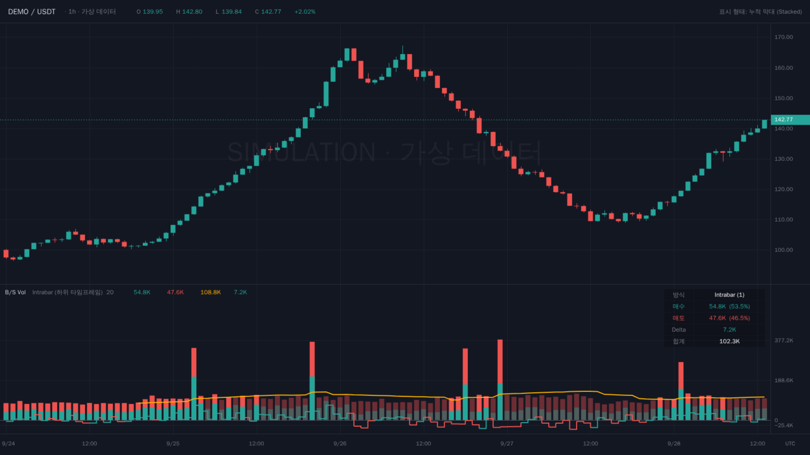
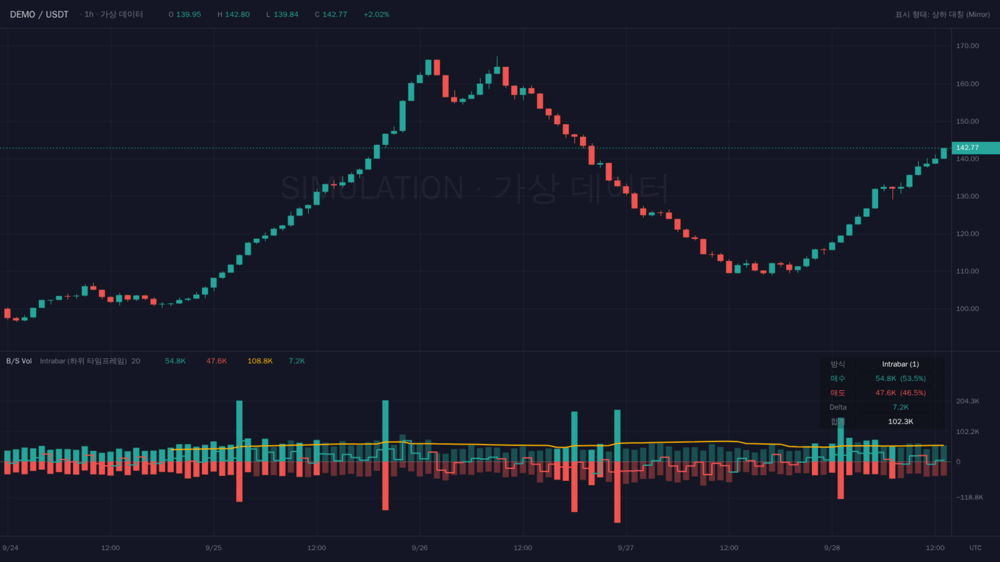

# 매수·매도 거래량 지표 (Buy/Sell Volume)

TradingView용 Pine Script v6 지표입니다. 각 봉의 거래량을 **매수 거래량**과 **매도 거래량**으로 나누어 함께 표시합니다.

- 코드: [`buy-sell-volume.pine`](buy-sell-volume.pine)

> ⚠️ 매수·매도 거래량은 거래소의 실제 체결 방향(틱) 데이터가 아니라 봉 모양으로 추정한 값입니다. 다른 지표와 함께 참고용으로 쓰세요.

## 화면 예시

> 아래 이미지는 TradingView 실제 캡처가 아닙니다. 가상 데이터(`DEMO / USDT`, 1시간봉)로 지표와 같은 계산 규칙을 적용해 TradingView 다크 테마처럼 그린 **시뮬레이션**입니다. 글꼴·축 눈금 등은 실제 화면과 조금 다를 수 있습니다.

**누적 막대 (Stacked, 기본값)** — 막대 아래 초록이 매수, 위 빨강이 매도



**상하 대칭 (Mirror)** — 0선 위가 매수, 아래가 매도



- 주황 선: 거래량 20봉 이동평균
- 초록/빨강 계단선: Delta (매수 − 매도)
- 흐린 막대: 평균 이하 거래량
- 오른쪽 위 표: 현재 봉의 계산 방식, 매수·매도량과 비율, Delta, 합계

## 1. 차트에 추가하기

1. TradingView에서 차트를 엽니다.
2. 화면 아래쪽 탭에서 **Pine 편집기**를 누릅니다.
3. 편집기 오른쪽 위 메뉴에서 **새로 만들기 → 인디케이터**를 고릅니다. 기본 코드가 들어 있으면 모두 지웁니다.
4. [`buy-sell-volume.pine`](buy-sell-volume.pine)의 전체 코드를 붙여넣습니다.
5. **저장**을 누르고 이름을 입력합니다(예: `매수매도 거래량`).
6. **차트에 추가**를 누르면 가격 차트 아래에 새 창으로 지표가 나타납니다.

TradingView 기본 거래량 지표가 켜져 있으면 둘 다 보일 수 있습니다. 필요 없으면 기본 거래량 지표를 숨기거나 삭제하세요.

오류가 나면 편집기 아래 콘솔에 줄 번호와 메시지가 표시됩니다.

## 2. 설정

지표 이름 옆의 **톱니바퀴(설정)** 아이콘이나 지표 창 더블클릭으로 설정 창을 엽니다. **입력값** 탭은 네 그룹으로 나뉩니다.

### ① 계산 방식

| 항목 | 설명 |
|---|---|
| **매수/매도 분리 방식** | 매수·매도를 나누는 방식을 고릅니다. 기본값은 **Intrabar**입니다. |
| **하위 타임프레임 자동 선택** | 켜 두면 차트 주기에 맞춰 자동으로 고릅니다. |
| **하위 타임프레임 (수동)** | 자동 선택을 끈 경우에만 사용됩니다. |

**Intrabar 방식 (권장)**

- 차트의 봉 하나를 더 작은 봉들로 쪼개서 봅니다.
- 작은 봉이 양봉이면 그 거래량을 매수로, 음봉이면 매도로 더합니다. 시가와 종가가 같은 봉은 반씩 나눕니다.
- 예를 들어 1시간봉 하나는 1분봉 60개를 모아 계산합니다.

자동 선택 규칙은 다음과 같습니다.

| 차트 주기 | 사용하는 하위 봉 |
|---|---|
| 1시간 이하 | 1분 |
| 4시간 이하 | 5분 |
| 일봉 | 15분 |
| 주봉 | 1시간 |
| 월봉 | 4시간 |

**Bar Range 방식**

- 봉 하나만 보고, 종가가 고가에 가까울수록 매수 비중을 크게 잡습니다.

  ```
  매수 = 거래량 × (종가 − 저가) / (고가 − 저가)
  매도 = 거래량 × (고가 − 종가) / (고가 − 저가)
  ```

- 예: 고가 110, 저가 100, 종가 108, 거래량 1,000이면 매수 800, 매도 200입니다.
- 계산이 가볍지만 Intrabar보다 덜 정밀합니다.

**자동 전환되는 경우**

다음 경우에는 Intrabar를 골라도 자동으로 Bar Range로 계산합니다.

- 오래된 과거 봉이라 하위 타임프레임 데이터가 없을 때
- 1분봉처럼 차트 주기가 이미 가장 작아서 더 작은 봉을 쓸 수 없을 때

지금 어떤 방식으로 계산 중인지는 정보 표의 **방식** 칸에 표시됩니다.

### ② 표시

| 항목 | 설명 |
|---|---|
| **표시 형태** | 누적 막대 또는 상하 대칭 중에서 고릅니다. |
| **매수 / 매도 색상** | 기본값은 초록 / 빨강입니다. |
| **평균 이하 거래량은 흐리게** | 이동평균보다 거래량이 적은 봉을 반투명하게 그려서, 거래량이 많은 봉이 눈에 띄게 합니다. |
| **Delta 선 표시** | 매수에서 매도를 뺀 값을 계단형 선으로 그립니다. |
| **현재 봉 정보 표 표시** | 오른쪽 위의 요약 표를 켜거나 끕니다. |

두 표시 형태는 다음과 같이 다릅니다.

```
누적 막대 (Stacked)          상하 대칭 (Mirror)
   ▇ ← 매도(빨강)              ▇ ← 매수(초록)
   ▇                          ▇
   █ ← 매수(초록)         ────────── 0선
   █                          ▇ ← 매도(빨강)
```

- **누적 막대:** 막대 전체 높이가 총 거래량이고, 아래 초록 부분이 매수, 위 빨강 부분이 매도입니다. 기본 거래량 차트에 익숙하면 이쪽이 편합니다.
- **상하 대칭:** 매수는 0선 위로, 매도는 아래로 그립니다. 매수와 매도의 크기를 바로 비교하기 좋습니다.

### ③ 거래량 이동평균

- 주황색 선으로 **총 거래량의 평균**을 그립니다. 기본 기간은 20봉입니다.
- 상하 대칭 형태에서는 막대 높이에 맞추려고 평균값의 절반 높이에 그립니다.

### ④ 알림 조건

| 항목 | 기본값 | 의미 |
|---|---|---|
| **거래량 급증 배수** | 2.0 | 총 거래량이 평균의 2배를 넘으면 "급증"으로 봅니다. |
| **우세 판단 비율** | 65% | 매수 또는 매도가 65% 이상이면 그쪽이 "우세"하다고 봅니다. |

## 3. 화면 읽는 법

### 정보 표 (오른쪽 위)

| 칸 | 내용 |
|---|---|
| 방식 | 지금 쓰는 계산 방식입니다. 예: `Intrabar (1)`은 1분봉 기준입니다. |
| 매수 | 매수 거래량과 비율(%) |
| 매도 | 매도 거래량과 비율(%) |
| Delta | 매수 − 매도. 양수면 초록, 음수면 빨강으로 표시됩니다. |
| 합계 | 총 거래량 |

### 과거 봉 값 확인

- 차트 오른쪽의 **데이터 창**을 열고 봉 위에 마우스를 올리면 됩니다.
- 그 봉의 매수·매도 거래량, Delta, **매수 비율 %**, **전체 거래량**을 모두 볼 수 있습니다.

### 해석 예시

| 상황 | 해석 |
|---|---|
| 가격 상승 + 매수 우세 + 거래량 증가 | 상승에 힘이 실려 있음 |
| 가격 상승 + 매도 비중 증가 | 위에서 물량이 나오고 있어 상승 힘이 약해질 수 있음 |
| 지지선 부근 + 거래량 급증 + 매수 우세 | 매수세가 받치고 있을 가능성 |
| Delta가 계속 +인데 가격이 안 오름 | 매수를 흡수하는 매도 물량이 있을 수 있음 |
| 평균 이하 거래량의 봉(흐린 막대) | 신호로서 신뢰도가 낮음 |

## 4. 알림 설정

1. 차트 위쪽의 **알림(⏰)** 버튼을 누르거나 `Alt + A`를 누릅니다.
2. **조건**에서 이 지표(`B/S Vol`)를 고릅니다.
3. 아래 세 가지 중 하나를 고릅니다.
   - **매수 우세 거래량 급증**
   - **매도 우세 거래량 급증**
   - **Delta 0선 교차**: 매수와 매도의 우세가 바뀐 순간입니다.
4. 트리거는 **"봉 마감 시 한 번"**을 권장합니다. 진행 중인 봉은 값이 계속 바뀌기 때문입니다.
5. 알림 방법(앱 푸시, 이메일 등)을 고르고 **생성**을 누릅니다.

## 5. 주의사항

- **추정치입니다.** 거래소의 실제 체결 방향(틱) 데이터가 아니라 봉 모양으로 추정한 값입니다.
- **진행 중인 봉은 값이 바뀝니다.** 봉이 마감된 뒤의 값으로 판단하세요.
- **Intrabar 데이터 범위에는 한계가 있습니다.** 하위 봉 데이터는 요금제에 따라 가져올 수 있는 개수가 제한됩니다. 그래서 차트를 멀리 과거로 넘기면 Bar Range로 바뀝니다. 같은 차트 안에서 과거 구간과 최근 구간의 계산 방식이 다를 수 있습니다.
- **거래량이 없는 종목**(일부 지수, 외환 등)에서는 "거래량 데이터를 제공하지 않습니다"라는 오류가 납니다. 외환은 거래량 대신 틱 거래량을 제공하는 경우가 많아 결과를 참고만 하세요.
- **Delta 선은 누적 막대와 한 창에 그려집니다.** Delta가 음수일 때는 0선 아래로 내려가 막대와 겹쳐 보일 수 있습니다. 보기 불편하면 **상하 대칭** 형태를 쓰거나 Delta 선을 끄세요.
